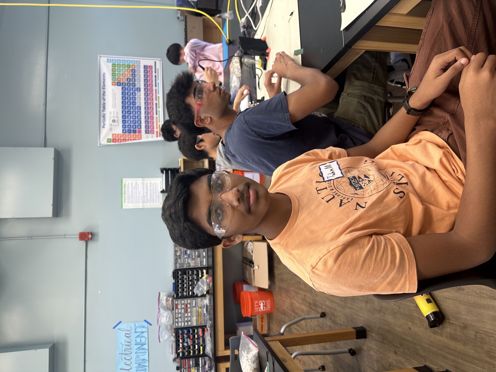
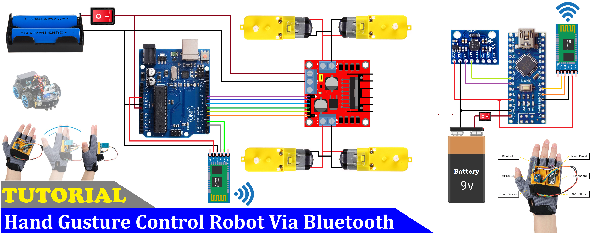

<!--//You should comment out all portions of your portfolio that you have not completed yet, as well as any instructions:-->

| **Engineer** | **School** | **Area of Interest** | **Grade** |
|:--:|:--:|:--:|:--:|
| Tuhin M | Bellarmine College Preparatory | Electrical Engineering and Computer Science | Rising Sophomore |

# Gesture Controlled Robot



# Final Milestone 6/19/24

<iframe width="560" height="315" src="https://www.youtube.com/embed/JfYVwFfUrE0?si=jVOveX24N32w_gOP" title="YouTube video player" frameborder="0" allow="accelerometer; autoplay; clipboard-write; encrypted-media; gyroscope; picture-in-picture; web-share" referrerpolicy="strict-origin-when-cross-origin" allowfullscreen></iframe>

# Images


  My final milestone was to succefully connect the gesture controller to the robot car and ensure that all functions were working properly. I was mainly focusing on the software section for this milestone. I accomplished this by first uploading the robot code to the robot and then the hand gesture code to the robot controller. Following that, I uploaded code to each bluetooth module in order to pair them together

  The technical side of what I wrote as part of my code is as follows. First, on the hand gesture side, I printed the accelerometer values from the bluetooth module into the Serial monitor. The accelerometer only gave XYZ values and I needed to convert those values into something the bluetooth module at the other end could use. I accomplished this issue by using if statements. I set a certain angle value as a direction. (eg. 45 degrees forward tilt equals R) As a result, instead of worrying about the three different values, I only had to worry about one character. I did this four times, for each direction. Next, I uploaded code to the robot car that recieved data from the controller, and then activated motors using if statements in order to determine the direction.

  ***THE BIGGEST HURDLE OF THE PROJECT***: Bluetooth...
    Getting the bluetooth connection between the robot module and the breadboard module was one of the most difficult aspects of this projects. In order to get the two modules paired, I had to research a lot about bluetooth modules, Arduino Nanos, and Arduino UNOs. Eventually, by crossreferencing two sources, I was able to succesfully set the gesture module as the master controller, and the robot module as the recipient of the data. Once I was able to do this, I was able to seamlessly integrate both the robot code and the gesture controller code into one master project. This Bluetooth journey exposed me to Serial Monitors and AT mode. These two attributes are the ones that determine master controllers and pairing for HC05 Bluetooth modules. After following a longwinded process of figuring out how to use AT mode and the Serial Monitor, I was able to succesfully pair the modules together.

  Going forward, I plan on adding some modifications to my project. One idea I have is to add a sensor that will detect whether or not the robot will run into obstacles. Then, the sensor will trigger an autonomous override in the code which will stop the robot from crashing. Another idea I had was to add LED headlights to the robot that would be toggleable or automatically turn on in the dark.


# Second Milestone 6/18/24

<iframe width="560" height="315" src="https://www.youtube.com/embed/5GENIZWkGWU?si=ucHo9exwd6dYC35o" title="YouTube video player" frameborder="0" allow="accelerometer; autoplay; clipboard-write; encrypted-media; gyroscope; picture-in-picture; web-share" referrerpolicy="strict-origin-when-cross-origin" allowfullscreen></iframe>

# Images


  My second milestone was to assemble the electrical and mechanical parts of the gesture controller. I wanted to build the parts that ensured that the gesture controller was completely sound and would not give me any failures. I accomplished this by first attaching the Arduino Nano to a breadboard and connecting it to the accelerometer. Basically, the accelerometer is a component that detects the X, Y, and Z positions of the breadboard. This is vital in order to determine the gestures of the controller. Next, I connected the bluetooth module to the Arduino Nano, so that I could send the values from the accelerometer. Finally, I connected the Arduino Nano to a 9 Volt battery in order to power the whole board.

  The technical side of what is happening within the controller is as follows. Power from the 9V battery goes to the Arduino Nano. The Nano in turn powers on the accelerometer through its wiring. The accelerometer picks up the data (XYZ position) of the breadboard, and then sends the data to the Bluetooth Module. The Bluetooth module then sends the data to the other bluetooth module on the robot car itself.

  Some challenges I faced was powering the module. When I attempted to power the module for the first time, I discovered that instead of turning the module on, all the happened was that the battery overheated. I solved this problem when I discovered that the solder joint wasn't properly created. As a result, I resoldered the connection, and the device started working.

  Going forward, I plan to code the robot software and the gesture controller software. By doing this, I will be able to succesfully transfer the data and get the robot car to move based on the gestures. Once I complete that milestone, I plan on adding a sensor to the robot that will detect obstacles and overide manual controls to prevent the robot car from crashing.
# First Milestone: 6/14/24

<iframe width="560" height="315" src="https://www.youtube.com/embed/WIJjrf_RyUc?si=iWhdWPHIjlC2sGut" title="YouTube video player" frameborder="0" allow="accelerometer; autoplay; clipboard-write; encrypted-media; gyroscope; picture-in-picture; web-share" referrerpolicy="strict-origin-when-cross-origin" allowfullscreen></iframe>

# Images


  My first milestone was purely mechanical and hardware based. I wanted to completely build all of the electrical and mechanical parts of the robot car. In order to accomplish this, I first attached four motors to a baseplate and wired them to the motor controller. Then, I connected the motor controller to the Arduino Uno and connected the battery pack to the Arduino Uno. Then, I connected all of the motor wires to the Arduino Uno and the motor controller. Once I did that, I attached the wheels and fastened the top plate to the robot. 

  The technical side of what is happening within the robot is that the power from the battery pack travels to the Arduino Uno which provides power to the motor controller. Then, the motor controller provides power to the motors, enabling them to run. 
  
  Some challenges I faced was that the motors had some trouble providing enough torque to spin the wheels. I solved this problem by letting them warmup before I attached the wheels. Another problem I faced was that one of the motors wasn't spinning. After debugging for a while, I discovered that it was because the motor wires weren't soldered properly together. Once I fixed this, I ran some expiremental code to test whether the motors would spin and the all succesfully spun. 
  
  Going forward, I plan to complete all of the hardware for the gesture controller. Then, I want to run the code and test whether or not the car will move according to the gesture detection. Once I complete all of these steps and ensure that the robot is fully functional with the gesture controller, I plan to add some extra features like side to side movement.


# Schematics 



# Code

***Test Code for Running Motors***
```c++
int In1 = 7; //Defining Digital Pins for Motors
int In2 = 8;
int In3 = 4;
int In4 = 12;
int ENA = 5; //Defining ENA for both sides
int ENA2 = 6;
int SPEED = 210; //Defining the speed of the wheels

void setup()
{

pinMode(In1,OUTPUT); //Designating the motors as outputs
pinMode(In2,OUTPUT);
pinMode(In3,OUTPUT);
pinMode(In4,OUTPUT);
pinMode(ENA,OUTPUT);
pinMode(ENA2,OUTPUT);

digitalWrite(In1,HIGH); //Setting the motor direction, either HIGH or LOW
digitalWrite(In2,LOW);
digitalWrite(In3,HIGH);
digitalWrite(In4,LOW);

analogWrite(ENA,SPEED); //Setting the speed for both sides
analogWrite(ENA2,SPEED);

}

void loop()
{

}
```

***Code for the Robot***
```c++
#include <SoftwareSerial.h>
SoftwareSerial BT_Serial(2, 3); // RX, TX

#define enA 10//Enable1 L298 Pin enA 
#define in1 9 //Motor1  L298 Pin in1 
#define in2 8 //Motor1  L298 Pin in1 
#define in3 7 //Motor2  L298 Pin in1 
#define in4 6 //Motor2  L298 Pin in1 
#define enB 5 //Enable2 L298 Pin enB 

char bt_data; // variable to receive data from the serial port
int Speed = 150; //Write The Duty Cycle 0 to 255 Enable Pins for Motor Speed  

void setup() { // put your setup code here, to run once

Serial.begin(9600); // start serial communication at 9600bps
BT_Serial.begin(9600); 

pinMode(enA, OUTPUT); // declare as output for L298 Pin enA 
pinMode(in1, OUTPUT); // declare as output for L298 Pin in1 
pinMode(in2, OUTPUT); // declare as output for L298 Pin in2 
pinMode(in3, OUTPUT); // declare as output for L298 Pin in3   
pinMode(in4, OUTPUT); // declare as output for L298 Pin in4 
pinMode(enB, OUTPUT); // declare as output for L298 Pin enB 

delay(200);
}
void loop(){
if(BT_Serial.available() > 0){  //if some date is sent, reads it and saves in state     
bt_data = BT_Serial.read(); 
Serial.println(bt_data);          
}
  
     if(bt_data == 'f'){forword();  Speed=180;}  // if the bt_data is 'f' the DC motor will go forward
else if(bt_data == 'b'){backword(); Speed=180;}  // if the bt_data is 'b' the motor will Reverse
else if(bt_data == 'l'){turnLeft(); Speed=250;}  // if the bt_data is 'l' the motor will turn left
else if(bt_data == 'r'){turnRight();Speed=250;} // if the bt_data is 'r' the motor will turn right
else if(bt_data == 's'){Stop(); }     // if the bt_data 's' the motor will Stop

analogWrite(enA, Speed); // Write The Duty Cycle 0 to 255 Enable Pin A for Motor1 Speed 
analogWrite(enB, Speed); // Write The Duty Cycle 0 to 255 Enable Pin B for Motor2 Speed 

delay(50);
}

void forword(){  //forword
digitalWrite(in1, HIGH); //Right Motor forword Pin 
digitalWrite(in2, LOW);  //Right Motor backword Pin 
digitalWrite(in3, LOW);  //Left Motor backword Pin 
digitalWrite(in4, HIGH); //Left Motor forword Pin 
}

void backword(){ //backword
digitalWrite(in1, LOW);  //Right Motor forword Pin 
digitalWrite(in2, HIGH); //Right Motor backword Pin 
digitalWrite(in3, HIGH); //Left Motor backword Pin 
digitalWrite(in4, LOW);  //Left Motor forword Pin 
}

void turnRight(){ //turnRight
digitalWrite(in1, LOW);  //Right Motor forword Pin 
digitalWrite(in2, HIGH); //Right Motor backword Pin  
digitalWrite(in3, LOW);  //Left Motor backword Pin 
digitalWrite(in4, HIGH); //Left Motor forword Pin 
}

void turnLeft(){ //turnLeft
digitalWrite(in1, HIGH); //Right Motor forword Pin 
digitalWrite(in2, LOW);  //Right Motor backword Pin 
digitalWrite(in3, HIGH); //Left Motor backword Pin 
digitalWrite(in4, LOW);  //Left Motor forword Pin 
}

void Stop(){ //stop
digitalWrite(in1, LOW); //Right Motor forword Pin 
digitalWrite(in2, LOW); //Right Motor backword Pin 
digitalWrite(in3, LOW); //Left Motor backword Pin 
digitalWrite(in4, LOW); //Left Motor forword Pin 
}
```

***Code for the Gesture Controller***
```C++
#include <SoftwareSerial.h>
SoftwareSerial BT_Serial(3, 2); // RX, TX

#include <Wire.h> // I2C communication library

const int MPU = 0x68; // I2C address of the MPU6050 accelerometer
int16_t AcX, AcY, AcZ;

int flag=0;

void setup () {// put your setup code here, to run once

  Serial.begin(9600); // start serial communication at 9600bps
  BT_Serial.begin(9600); 

  // Initialize interface to the MPU6050
  Wire.begin();
  Wire.beginTransmission(MPU);
  Wire.write(0x6B);
  Wire.write(0);
  Wire.endTransmission(true);

  delay(500); 
}

void loop () {
  Read_accelerometer(); // Read MPU6050 accelerometer

  if (AcX<60  && flag==0) {
    flag=1;
    BT_Serial.write('f');
  }
  if (AcX>130 && flag==0) {
    flag=1;
    BT_Serial.write('b');
  }
        
  if (AcY<60  && flag==0) {
    flag=1;
    BT_Serial.write('l');
  }
  if (AcY>130 && flag==0) {
    flag=1;
    BT_Serial.write('r');
  }
    
  if((AcX>70) && (AcX<120) && (AcY>70) && (AcY<120) && (flag==1)) {
    flag=0;
    BT_Serial.write('s');
  }

  delay(100);  
}

void Read_accelerometer(){
  // Read the accelerometer data
  Wire.beginTransmission(MPU);
  Wire.write(0x3B); // Start with register 0x3B (ACCEL_XOUT_H)
  Wire.endTransmission(false);
  Wire.requestFrom(MPU, 6, true); // Read 6 registers total, each axis value is stored in 2 registers

  AcX = Wire.read() << 8 | Wire.read(); // X-axis value
  AcY = Wire.read() << 8 | Wire.read(); // Y-axis value
  AcZ = Wire.read() << 8 | Wire.read(); // Z-axis value

  AcX = map(AcX, -17000, 17000, 0, 180);
  AcY = map(AcY, -17000, 17000, 0, 180);
  AcZ = map(AcZ, -17000, 17000, 0, 180);

  Serial.print(AcX);
  Serial.print("\t");
  Serial.print(AcY);
  Serial.print("\t");
  Serial.println(AcZ); 
}

```

***Code for the Bluetooth Connection***
```C++
#include <SoftwareSerial.h>

SoftwareSerial Bluetooth(3, 2);

void setup() 
{
  Serial.begin(9600);
  Bluetooth.begin(38400);
}

void loop(){
  if (Bluetooth.available())
    Serial.write(Bluetooth.read());
  
  if (Serial.available())
    Bluetooth.write(Serial.read());
}
```

# Bill of Materials

| **Part** | **Note** | **Price** | **Link** |
|:--:|:--:|:--:|:--:|
| Arduino UNO | Used to control the robot movement | $25.81 | <a href="https://www.newark.com/arduino/a000066/dev-board-atmega328-arduino-uno/dp/78T1601?COM=ref_hackster&CMP=Hackster-NA-project-94b13d-Jun-24"> Link </a> |
| Arduino Nano R3 | Used for the hand mounted part | $23.23 | <a href="https://www.newark.com/arduino/a000005/dev-board-atmega328-arduino-nano/dp/13T9275?COM=ref_hackster&CMP=Hackster-NA-project-e1c9f9-Jun-24"> Link </a> |
| Inertial Measurement Unit (IMU) (6 deg of freedom) | Used for sensing changes and movement | $5.99 | <a href="https://www.amazon.com/dp/B008BOPN40/?tag=octopart00-20"> Link </a> |
| SparkFun Dual H-Bridge motor drivers L298 | Used to control the motors | $7.21 | <a href="https://www.amazon.com/Diymall-Module-Stepper-Modules-Arduino/dp/B00NJOTBOK/ref=asc_df_B00NJOTBOK/?tag=hyprod-20&linkCode=df0&hvadid=693611984328&hvpos=&hvnetw=g&hvrand=11587990999031796711&hvpone=&hvptwo=&hvqmt=&hvdev=c&hvdvcmdl=&hvlocint=&hvlocphy=9032183&hvtargid=pla-2062985254553&psc=1&mcid=170f1bbf2f773d04a1c0254ec6413a12&gad_source=1"> Link </a> |
| Solderless Breadboard Half Size | Used to hold the pins and devices for the controller | $4.96 | <a href="https://www.newark.com/adafruit/64/bread-board-prototype-electronics/dp/53W6131"> Link </a> |
| HC-05 Bluetooth Module | Used for connecting the robot car to the controller on the wrist | $10.39 | <a href="https://www.amazon.com/HiLetgo-Wireless-Bluetooth-Transceiver-Arduino/dp/B071YJG8DR"> Link </a> |
| Male/Male Jumper Wires | Used to connect electronics to the boards | $2.10 | <a href="https://www.digikey.com/en/products/detail/sparkfun-electronics/PRT-12795/5993860?utm_adgroup=&utm_source=google&utm_medium=cpc&utm_campaign=Pmax_Shopping_Product_Silicon%20Valley%20Category%20Awareness&utm_term=&utm_content=&utm_id=go_cmp-20773039395_adg-_ad-__dev-c_ext-_prd-5993860_sig-CjwKCAjwjqWzBhAqEiwAQmtgT4yqEvNPG-CeiyWY2SfxfZpecU3iTeRpYc_iE8nQLuzfGLUG7xOabxoCPq8QAvD_BwE&gad_source=1&gclid=CjwKCAjwjqWzBhAqEiwAQmtgT4yqEvNPG-CeiyWY2SfxfZpecU3iTeRpYc_iE8nQLuzfGLUG7xOabxoCPq8QAvD_BwE"> Link </a> |
| Male/Female Jumper Wires | Used to connect electronics to the boards | $4.11 | <a href="https://www.newark.com/adafruit/826/wire-gauge-28awg/dp/88W2802?COM=ref_hackster"> Link </a> |
| DC Motor, 12 V | Used to make the robot move | $2.10 | <a href="https://www.digikey.com/en/products/detail/sparkfun-electronics/ROB-11696/6163657?utm_adgroup=&utm_source=google&utm_medium=cpc&utm_campaign=PMax%20Shopping_Product_Low%20ROAS%20Categories&utm_term=&utm_content=&utm_id=go_cmp-20243063506_adg-_ad-__dev-c_ext-_prd-6163657_sig-CjwKCAjwjqWzBhAqEiwAQmtgT6PUzEZcO3nk_kRwzXNGFYU7V3DIX_euwD9z8G3limBqyci_jx-AWxoC1YkQAvD_BwE&gad_source=1&gclid=CjwKCAjwjqWzBhAqEiwAQmtgT6PUzEZcO3nk_kRwzXNGFYU7V3DIX_euwD9z8G3limBqyci_jx-AWxoC1YkQAvD_BwE"> Link </a> |
| Pimoroni Maker Essentials - Micro-motors & Grippy Wheels | Used to translate the motor power to movement | $33.79 | <a href="https://shop.pimoroni.com/products/maker-essentials-micro-motors-grippy-wheels?variant=1418711662602"> Link </a> |
| Rocker Switch, SPST | Used to switch the robot and controller on and off | $1.26 | <a href="https://www.digikey.com/en/products/detail/triad-components-group,-inc/RF1-1A-DC-2-R-1/11492837?utm_adgroup=&utm_source=google&utm_medium=cpc&utm_campaign=PMax%20Shopping_Product_Low%20ROAS%20Categories&utm_term=&utm_content=&utm_id=go_cmp-20243063506_adg-_ad-__dev-c_ext-_prd-11492837_sig-CjwKCAjwjqWzBhAqEiwAQmtgT7oTJas8J3dyOTnXepZN0X2aoT77Lba8JHsMW7X9lC3OWGfcfXICZBoC4eEQAvD_BwE&gad_source=1&gclid=CjwKCAjwjqWzBhAqEiwAQmtgT7oTJas8J3dyOTnXepZN0X2aoT77Lba8JHsMW7X9lC3OWGfcfXICZBoC4eEQAvD_BwE"> Link </a> |
| 9V Battery Clip | Used to connect to the battery pack | $0.309 | <a href="https://www.newark.com/keystone/233/battery-strap-9v-wire-lead/dp/22C4351"> Link </a> |
| 9V battery (generic) | Used to power the robot | $1.54 | <a href="https://www.tequipment.net/Techni-Pro/TNP-AL9V-ea/Batteries-and-Chargers/?Source=googleshopping&gad_source=1&gclid=CjwKCAjwjqWzBhAqEiwAQmtgT4aHyiP0JiLkauY-n9bLEDgScQHZIqa6-ZshwL10lhdLS98RW5EJBBoC1nQQAvD_BwE"> Link </a> |
| Battery Holder, 18650 x 2 | Used to hold the batteries | $9.48 | <a href="https://www.newark.com/keystone/1048/battery-holder-18650-li-ion-2cell/dp/56T2029?COM=ref_hackster&CMP=Hackster-NA-project-94b13d-Jun-24"> Link </a> |
| Arduino IDE | Used to code the functionalities of the robot | $0.00 | <a href="https://www.arduino.cc/en/software"> Link </a> |


# Other Resources/Examples
- [Team PSI](https://www.youtube.com/watch?v=OkHR1BZCcqA)
- [Hackster.io](https://www.hackster.io/embeddedlab786/hand-gesture-control-robot-via-bluetooth-94b13d#story)
- [Instructables](https://www.instructables.com/Arduino-Two-Way-Communication-Via-Bluetooth-HC-05/)

# Arduino Starter Project: 6/12/24

<iframe width="560" height="315" src="https://www.youtube.com/embed/MTDgItoHk8w?si=aqH-RLGaW8Hp8VCv" title="YouTube video player" frameborder="0" allow="accelerometer; autoplay; clipboard-write; encrypted-media; gyroscope; picture-in-picture; web-share" referrerpolicy="strict-origin-when-cross-origin" allowfullscreen></iframe>

The Arduino Starter Project provided a basic foundation for learning soldering and coding with Arduino. As part of the project, I built a Proto Shield for the Arduino UNO. This Proto Shield featured a reset button, resistors, LEDs, and rails for wire inputs. Using the Proto Shield, the Arduino UNO, and breadboard I built a circuit with a LED that was controlled by a button. I coded this button and LED using Arduino IDE, an application that uploaded code to the Arduino UNO. I used conditional statements to detect button presses and translate the result gained into a signal to turn the LED on or off.

# Code

```c++
//Defining the LED position on the Breadboard
#define LED_PIN 8
//Defining the Button position on the Breadboard
#define BUTTON_PIN 7

void setup() {
  //Defining the LED as the Output
  pinMode(LED_PIN, OUTPUT);
  //Defining the Button as the Input
  pinMode(BUTTON_PIN, INPUT);
}
void loop() {
  if (digitalRead(BUTTON_PIN) == HIGH) { //If the button is pressed
    digitalWrite(LED_PIN, HIGH); //Turn on the LED
  }
  else { //If the button is not pressed
    digitalWrite(LED_PIN, LOW); //Keep the LED off
  }
}
```

# Bill of Materials

| **Part** | **Note** | **Price** | **Link** |
|:--:|:--:|:--:|:--:|
| Arduino Uno | Control the circuit power and ground | $24.50 | <a href="https://www.amazon.com/Arduino-A000066-ARDUINO-UNO-R3/dp/B008GRTSV6/"> Link </a> |
| USB A -> B cable | Connection to computer | $9.89 | <a href="https://www.amazon.com/Amazon-Basics-External-Gold-Plated-Connectors/dp/B00NH13DV2?th=1"> Link </a> |
| Arduino Proto Shield | Used to make easier wire connections | $9.95 | <a href="https://learn.adafruit.com/adafruit-proto-shield-arduino"> Link </a> |
| Breadboard | Used to hold LED, Button, and wiring | $2.90 | <a href="https://www.digikey.com/en/products/detail/dfrobot/FIT0096/7597069?utm_adgroup=&utm_source=google&utm_medium=cpc&utm_campaign=PMax%20Shopping_Product_High%20ROAS%20Categories&utm_term=&utm_content=&utm_id=go_cmp-20222717502_adg-_ad-__dev-c_ext-_prd-7597069_sig-CjwKCAjw65-zBhBkEiwAjrqRMI_n1aAgL784j99C-KhXqSOPK8ByCWra4Myz7QmtGApcpn9UfPkQYRoCAbgQAvD_BwE&gad_source=1&gclid=CjwKCAjw65-zBhBkEiwAjrqRMI_n1aAgL784j99C-KhXqSOPK8ByCWra4Myz7QmtGApcpn9UfPkQYRoCAbgQAvD_BwE"> Link </a> |
| Male to Male Connectors | Used to connect electronics | $2.10 | <a href="https://www.digikey.com/en/products/detail/sparkfun-electronics/PRT-12795/5993860?utm_adgroup=&utm_source=google&utm_medium=cpc&utm_campaign=Pmax_Shopping_Product_Silicon%20Valley%20Category%20Awareness&utm_term=&utm_content=&utm_id=go_cmp-20773039395_adg-_ad-__dev-c_ext-_prd-5993860_sig-CjwKCAjwjqWzBhAqEiwAQmtgT6kuQk86BHPzUXokCss1tlPM5KsUHGUijRBNL3osiZAj6gI66WffEBoCMDIQAvD_BwE&gad_source=1&gclid=CjwKCAjwjqWzBhAqEiwAQmtgT6kuQk86BHPzUXokCss1tlPM5KsUHGUijRBNL3osiZAj6gI66WffEBoCMDIQAvD_BwE"> Link </a> |
